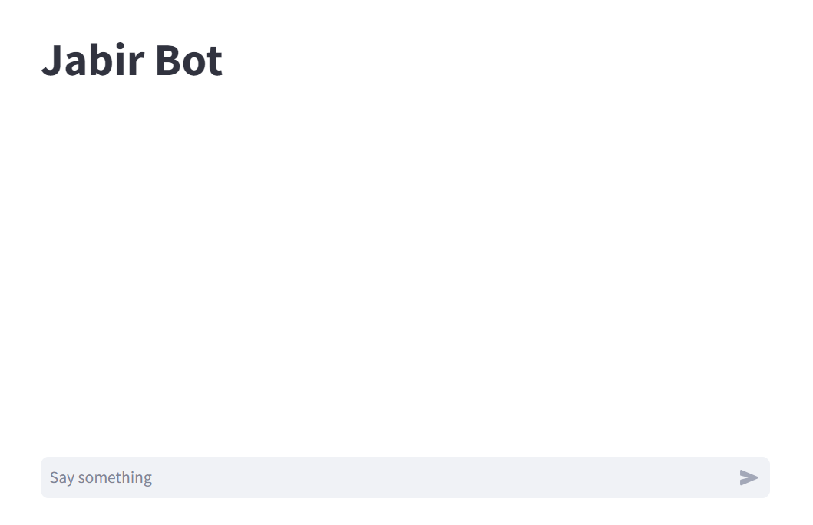

# Jabir LLM

In this example I have written a simple code to work with an LLM model named `Jabir`. `Jabir` has been developed and trained by [Mohammad Reza Haghiri](https://haghiri75.com/en/) and you can access to this project by this [Link](https://jabirproject.org/).

My code is a chat bot which gives you a simple place to have conversation with this LLM model. 

## Requirements
To run this code, you only need to install the following packages using pip.
```bash
pip install streamlit requests
```
After that, you should get an api code from [this link](https://jabirproject.org/#api). Then, you should insert it into `chat_view.py` file as `api_code` variable. 

## How to Run

After satisfying the requirements, you should open an terminal and to run this code insert the below command
```bash
streamlit run chat_view.py
```

Then, a page will pop up in your browser, where you will see a something like this

 

You can ask your questions in the chat section, and then the model will answer to you. attention that you need internet access if you want model answer you.