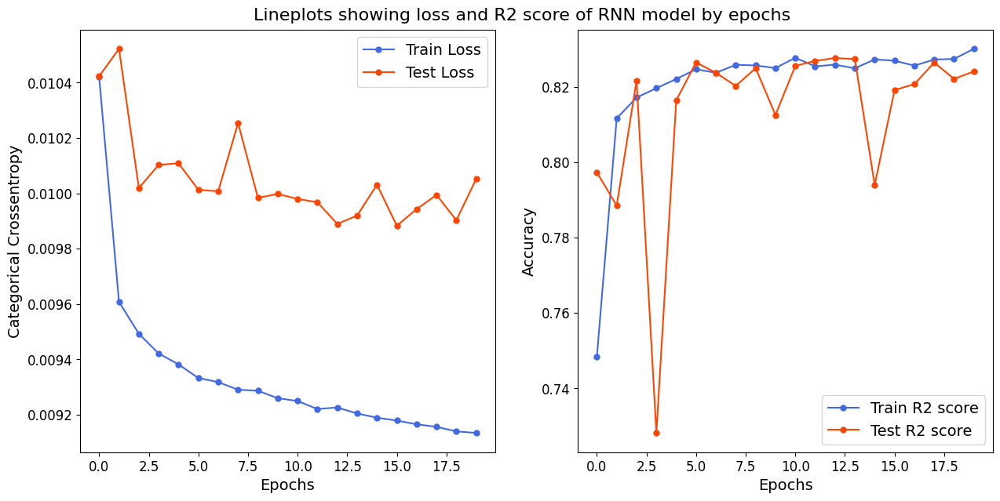

# Weather Prediction

In this example we have some data about the status of weather. We have 9 columns which describe the weather. These columns are:

- date
- pollution
- dew
- temp
- press
- wnd_dir
- wnd_spd
- snow
- rain

 As this data is a time-serie data, we are going to predict its data using RNN models.

 ## How to use
 For using this code, you should have these listed packages:

- Tensorflow
- Keras
- Matplotlib
- Numpy
- pandas

for installing these packages, you can use pip. Dataset is uploaded. So there is no need to download dataset.

## Result

We will use 'R2 Score' for our metric of validation. Our best score is above 82%. Our score on test dataset is also 82%. You can see a chart about our loss and r2 score. 
